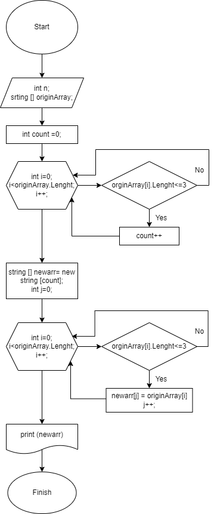

**Задача:**

Написать программу, которая из имеющегося массива строк формирует массив из строк, длина которых мньше либо равна 3 символа.
Первоначальный массив можно ввести с клавиатуры, либо задать на старте выполнения алгоритма.
При решении не рекомендуется пользоваться коллекциями, лучше обойтись исключительно массивами.

**Примеры:**

>["hello","2","world",":-)"]->["2",":-)"]
>["1234","1567","-2","computer science"]->["-2"]
>["Russia","Denmark","Kazan"]->[]

**Решение:**

Создаем массив строк  - нужен отдельный метод **CreateArray(int size)** с заданным количеством элементов size, который выводит его на консоль.

Длину массива задает пользователь положительным числом **n** - добавляем цикл с проверкой (n>0).

Массив **originArray** фиксируем как первоначальный заданный пользователем с клавиатуры с помощью метода CreateArray с количеством элементов n.

Далее для удобства нужна функция **CountSigns (string a)**, которая считает количество знаков элемента массива.

Создаем еще один метод **CountElemArrLenghtLessThen3 (string [] inArray)** который считает количество элементов массива с длиной <=3. Вводим переменную count, далее с помощью цикла проверяем каждый элемент массива на условие: если число знаков элемента меньше равно 3 (CountSigns(inArray[i])<=3) тогда добавляем элемент в счетчик (count++), иначе не считаем этот элемент (count=count).

Основная часть это метод **NewArray(string [] inArray)** - это метод создает из имеющегося массива inArray (в нашем случае заданный массив originArray) новый массив **newarr** с количеством элементов CountElemArrLenghtLessThen3 (inArray) - в новый массив должны попасть только элементы массива с длиной <=3.
Вводим новый массив newarr с индексами j, задаем j = 0.
С помощью цикла проверерям каждый элемент оригинального массива inArray на выполение условия: CountSigns(inArray[i])<=3) тогда записываем в новый массив newarr[j] = inArray[i] и добавляем счетчик j++ (индекс нового массива). Берем следующий элемент нового массива и записываем в него удовлетворяющий условию следующий элемент первоначального массива. Проходим циклом весь первоначальный массив и на выходе получаем новый массив newarr.
Выводим новый массив на консоль через Console.Write
Задача решена.

**Порядок действий:**

1. Создан репозиторий на GitHub 
> https://github.com/MargaritaFateeva/FinalVerificationWork_Block1.git

Создана пустая папка на локальном компьютере и с помощью **git clone** скопирован пустой репозиторий с GitHub

2. Нарисована блок-схема алгоритма:
> 
3. Написана программа, решающая поставленную задачу
4. Создан файл README.md
5. С помощью **git push** код решения задачи, блок схема и описание залиты отдельными коммитами в репозиторий на GitHub.